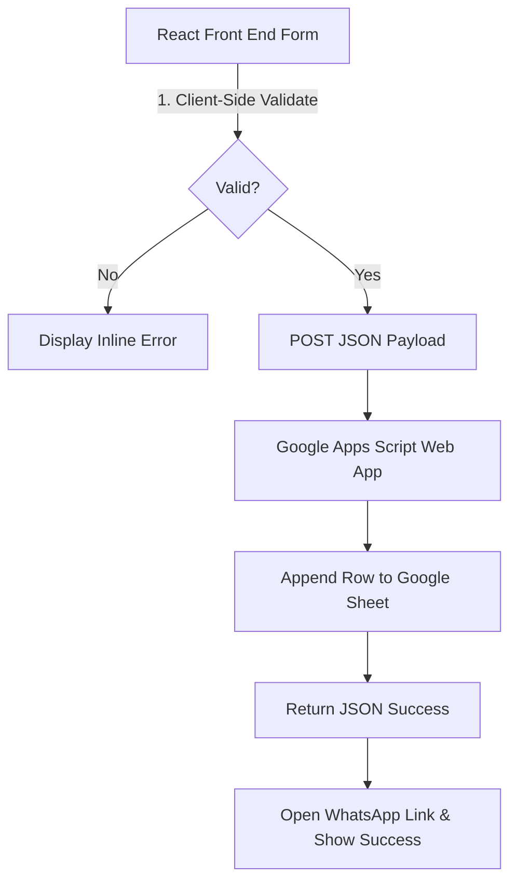

# Google Sheets Integration & Form Validation Plan

This plan outlines the validation rules for the booking form and the serverless architecture to securely store entries in a Google Sheet without exposing API credentials.

---

## 📋 1. Form Validation Rules

To ensure high-quality data is sent to your Google Sheet, we will implement strict validations directly in the frontend using React state and regex patterns.

| Field | Validation Rule | Regex Pattern | Error Feedback |
| :--- | :--- | :--- | :--- |
| **Name** | Letters & spaces only, 2-50 characters. | `^[A-Za-z\s]{2,50}$` | "Please enter a valid name (2-50 letters only)." |
| **Phone** | Standard 10-digit Indian mobile number (optionally prefixed with +91, 91, or 0). | `^(?:\+91\|91\|0)?[6-9]\d{9}$` | "Please enter a valid 10-digit Indian phone number." |
| **Device Model** | Alphanumeric, spaces, hyphens, min 3 chars. | `^[a-zA-Z0-9\s\-\,\.]{3,100}$` | "Please specify a device (minimum 3 characters)." |

---

## ☁️ 2. Google Sheets Integration Architecture

To connect the React app to Google Sheets securely and for **free**, we will use a **Google Apps Script Web App**.



### Advantages of this approach:
* **Zero Cost**: Google Apps Script is completely free to use.
* **Security**: No database passwords or Google Cloud IAM keys are exposed in your public React source code.
* **Ease of Use**: Apps Script handles the spreadsheet appending in 10 lines of code.

---

## 🛠️ 3. Step-by-Step Setup Guide

### Step A: Set up your Google Sheet & Apps Script
1. Create a new Google Sheet named **Applifix Bookings**.
2. Create the following column headers in Row 1:
   * **Timestamp**
   * **Name**
   * **Phone**
   * **Device**
   * **Service**
   * **Repair Type**
3. In the Google Sheets menu, click **Extensions** > **Apps Script**.
4. Replace the default code with this script:

```javascript
function doPost(e) {
  try {
    const data = JSON.parse(e.postData.contents);
    const sheet = SpreadsheetApp.getActiveSpreadsheet().getActiveSheet();
    
    // Append the row: Timestamp, Name, Phone, Device, Service, Repair Type
    sheet.appendRow([
      new Date().toLocaleString("en-IN", { timeZone: "Asia/Kolkata" }),
      data.name,
      data.phone,
      data.device,
      data.service,
      data.repairType
    ]);
    
    return ContentService.createTextOutput(JSON.stringify({ status: "success" }))
      .setMimeType(ContentService.MimeType.JSON);
  } catch (error) {
    return ContentService.createTextOutput(JSON.stringify({ status: "error", message: error.toString() }))
      .setMimeType(ContentService.MimeType.JSON);
  }
}

// Handle CORS Preflight Requests
function doOptions(e) {
  return ContentService.createTextOutput("")
    .setMimeType(ContentService.MimeType.TEXT);
}
```

5. Click the **Deploy** button (top right) > **New deployment**.
6. Select type: **Web App**.
7. Set configuration:
   * **Execute as**: `Me` (your email)
   * **Who has access**: `Anyone` (this lets your React app send submissions anonymously)
8. Click **Deploy**, authorize permissions, and copy the **Web App URL** (e.g. `https://script.google.com/macros/s/.../exec`).

---

### Step B: Connect React Frontend
1. We will update `BookingModal.jsx` to manage validation errors in local state.
2. We will add a loading spinner state so the user sees a "Submitting..." indicator while the Apps Script runs.
3. We will trigger the WhatsApp link *after* the POST request completes successfully, ensuring the Google Sheet is always populated first.

---

Would you like me to implement the React validation and connection code in `BookingModal.jsx` now?
